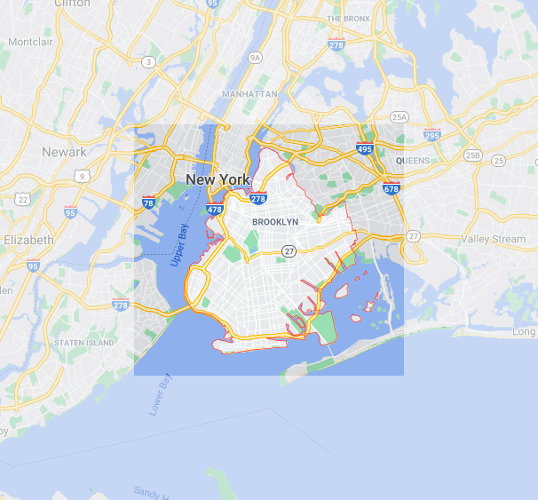
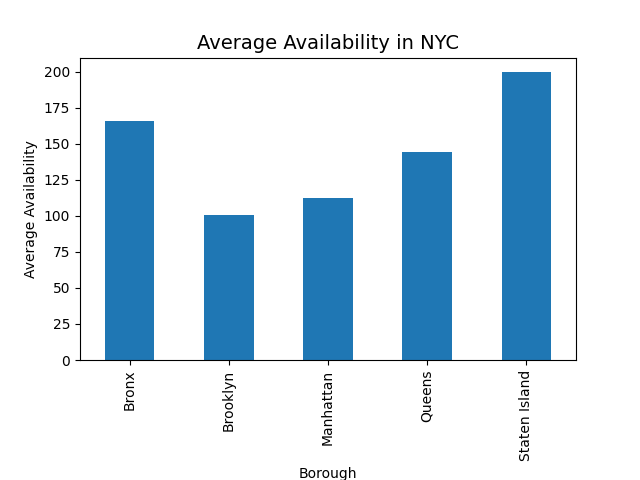
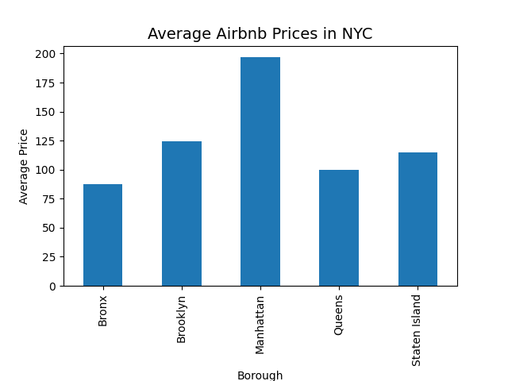
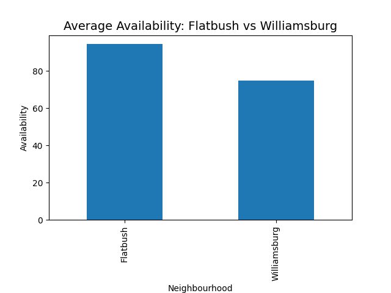
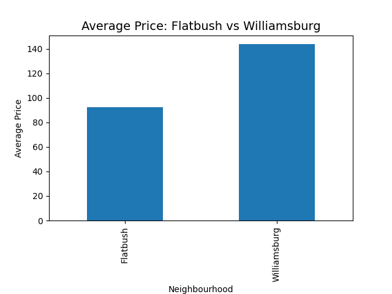

  

New York City is a hotspot for travel. Brooklyn is one of the more popular boroughs to visit. We can learn more about people traveling to Brooklyn by looking into the listings of Airbnbs in Brookyln. We analyzed the data of Airbnb listings in NYC for 2019 to draw conclusions about Brooklyn and the guests who travel to this borough.  

We focused on Brooklyn as a group, and individually focused on our own neighborhoods. Jean Zion worked on Williamsburg and Fionna Du worked on Flatbush, two popular parts of the borough.  

### Overview of Brooklyn
Using Availability is a measure, Brooklyn is the most popular borough for Airbnb rentals. It is also the second-most expensive.
  
  

### Flatbush vs. Williamsburg
We looked through the websites Street Advisor, Brick, DNAInfo, and Niche to assess our neighborhoods. There is some contradiction on which neighborhood rank higher overall. Whereas Niche ranks Williamsburg higher, StreetAdvisor prefers Flatbush. Based on the three most important qualities that we chose (safety, transportation, and recreation), the two neighborhoods fare pretty equally.
Regarding transportation, both boroughs have an "A" ranking on Niche for commute and have accessible subway lines. Williamsburg has an edge over Flatbush since it is closer in proximity to Manhattan. 
Regarding recreation, both neighborhoods have an "A" in Outdoor Activities on Niche, but Williamsburg has an "A+" in nightlife, whereas Flatbush has an "A". Williamsburg also has more attractions than Flatbush, which makes it more appealing. 
Overall, Williamsburg ranks higher than Flatbush as a place to stay at an Airbnb, which is corrobated by our data analysis.

Flatbush is more affordable than Wiliamsburg, but Williamsburg has much less availability. This indicates that it is popular despite the higher prices.
  
  

### Neighborhood Links

[Flatbush](https://fionnadu.github.io/Flatbush/)  

[Williamsburg](https://jmzion.github.io/HC10/)

